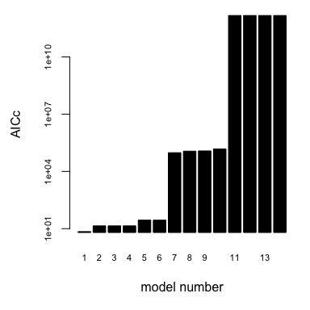
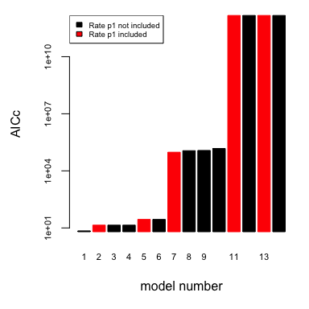
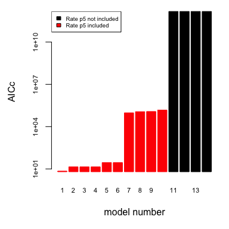
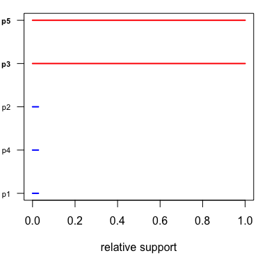

Graphical evaluation of the model selection process
===================================================

The UMSA package comes with a variety of functions that allow to plot the outcome of the model selection algorithm in a convenient way. These functions can be helpful to assess the performance of the model selection algorithm and help in interpreting the support of each model parameter.

For this tutorial we will first run our general example again:

``` r
library(UMSA)
 #set the future plan (see future documentation for more information)
 future::plan(future::sequential)

 #create data with standard deviation of 1
 x.values <- 1:7
 y.values <-  9 * x.values^2 - exp(2 * x.values)
 sd.y.values <- rep(1,7)

 #define initial parameter values
 inits <- c(p1 = 3, p2 = 4, p3 = -2, p4 = 2, p5 = 0)

 #define cost function that returns the negative log-likelihood
 cost_function <- function(parms, x.vals, y.vals, sd.y){
  # restrict the search range to -5 to +5
  if(max(abs(parms)) > 5){
    return(NA)
  }
  with(as.list(c(parms)), {
    res <- p1*4 + p2*x.vals + p3^2*x.vals^2 + p4*sin(x.vals)  - exp(p5*x.vals)
    diff <- sum((res - y.vals)^2/sd.y)
  })
 }

 #define swap parameter sets
 swaps <- list(c("p1", "p5"))
 
 #perform model selection
 res <- UMSA(init.par = inits,
            fit.fn = cost_function,
            nr.of.data = length(y.values),
            homedir = getwd(),
            init.model.type = c("p1", "p2"),
            optim.runs = 1,
            method = "swap",
            swap.parameters = swaps,
            x.vals = x.values,
            y.vals = y.values,
            sd.y = sd.y.values)
```

To assess the performance of a specific UMSA run, the function *umsa.performance* can be used. This generates a plot showing the improvement in the information criterion over the course of each UMSA iteration along with the corresponding best model.

``` r
umsa.performance(input = res$mrun)
```


The circles in the lower plot what happened during each UMSA iteration. Here, parameter *p1* was swapped for *p5* in the second iteration (blue circles), parameter *p3* was added in the third iteration (green circle) and parameter *p2* was removed in the fourth iteration (red circle). After that, the UMSA tried to find better models with the succession of the methods *backward*, *forward* and *swap*, but did not succeed. Therefore the model selection procedure was terminated after the eighth iteration. The best model, therefore consists of the parameters *p3* and *p5* and the corresponding AICc is shown on the right axis of the upper plot.

Note that the performance of the UMSA can also be checked while the algorithm is still running. After the third iteration, a plot generated by *umsa.performance* will be stored in the "AMS/Figures/" folder. This plot will be updated at the end of each iteration. Alternatively, the function can also be called in the console.

In a next step, we can check how the tested models are distributed in terms of the used information criterion (here: AICc). To this end, we call the function *ic.order*.

``` r
 ic.order(input = getwd(), mrun = res$mrun, log = T)
```



We can also use this function to check how certain parameters affect the value of the information criterion

``` r
 par(mfrow = c(1,2))
 ic.order(input = getwd(), mrun = res$mrun, colour.par = "p1", log = T)
```



``` r
 ic.order(input = getwd(), mrun = res$mrun, colour.par = "p5", log = T)
```



Here, we can see that all models that contain *p5* perform much better than models that don't have this parameter.

We can analyse the support of each parameter even more closely by calculating the Akaike weights with the function *aicc.weights*, which gives a normalised description of the importance of parameters. Roughly, values close to 1 indicate high and values close to 0 weak to no support. Parameters with intermediate support might indicate a necessity of having a certain feature in the model to describe the data, but this feature might be achieved by different parameters.

``` r
aicc.weights(input = getwd(), mrun = res$mrun)
```



    #>         p1         p2         p3         p4         p5 
    #> 0.02771283 0.02773808 1.00000000 0.02771283 1.00000000
